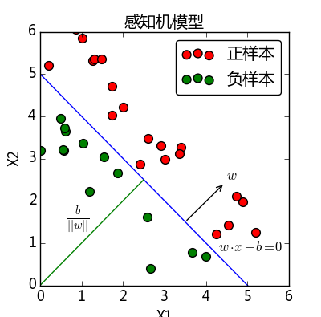

#### 感知机模型
y=sign(θ∙x + b)



##### 知识点
- 矩阵
- 转置矩阵
- 矩阵乘积
- 内积
- 对称矩阵

##### 算法实现

```python

    # -*- coding: UTF-8 -*-

    import numpy as np

    x = np.array([[2,1],[3,1],[1,1]])#创建数据集，共3个实例
    y = np.array([1,1,-1])           #创建标签
    history = []                     #存储迭代学习过程中的w,b值，便于可视化绘图

    #x.T是转置矩阵
    gramMatrix = x.dot(x.T)
    #计算得到对称矩阵

    alpha = np.zeros(len(x))        #初始化alpha为零向量
    b = 0                           #b为回归直线截距
    learnRate = 1                   #初始化为0；learnRate为学习率，设为1
    k = 0; i = 0                    #k用来计算迭代次数；i用来判定何时退出while循环 

    while 1: 

        if y[i] * (np.sum(alpha * y * gramMatrix[i]) + b)<=0: #误分条件：若某一数据点被错误分类    
            alpha[i] = alpha[i] + learnRate           #更新 alpha 值
            b = b + learnRate * y[i]                  #更新 b 值
            i = 0                                     #i 赋值为0，再遍历一次所有的数据集
            k = k + 1                                 #k + 1 即迭代次数加1
            continue
        else:                       #若某一数据点被正确分类
            i = i + 1
        if i >= x.shape[0]:        #退出while循环条件,即 i >= 3，所有数据点都能正确分类
            break                  #break 退出wile循环

    w = (alpha*y).dot(x)         #计算得到权值 w
    print "w = ", w
    print "b = ", b
    print "模拟次数：", k

```

#### 深度神经网络（DNN）
DNN内部的神经网络层可以分为三类，输入层，隐藏层和输出层

#### DNN内部都可以看做：
线性关系z=∑wixi+b加上一个激活函数σ(z)。