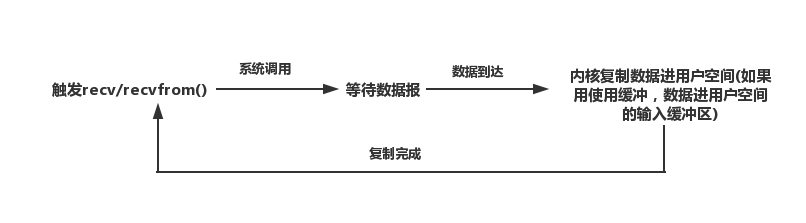
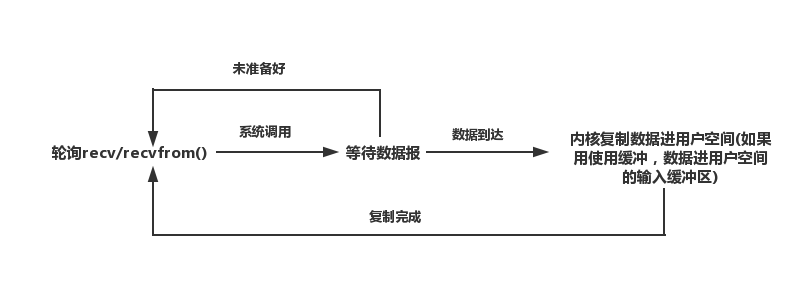

### io模型
- 同步阻塞io
- 同步非阻塞io(polling轮询)
- io多路复用(epoll 、poll、select)
- 信号驱动式io
- 异步io

### 不同io模型的优劣与适用场景

#### 同步阻塞io

在php的fpm进程中就是使用的这种模式。一个fpm进程同一时间只能处理一个请求。
##### 优势
- 进程复用，性能好。
##### 劣势
- 并发性不高，依赖fpm进程数。进程数过高对内存与cpu有直接影响
##### 适用场景
- web项目，对并发要求不是很高的场景。

#### 同步非阻塞io

占用CPU的时间，效率很低效，很少使用。并且由于有轮询的间隔响应时间不是很理想。

#### io多路复用
nginx就是使用的epoll来实现的io多路复用
##### 优势
- 支持高并发，占用内存少。
##### epoll 、poll、select的区别
- select有连接数限制，poll解决了此问题，但是需要通过轮询遍历所有的fd。这样的后果就是fd数量越大，poll、select的性能就越差。
- epoll通过事件回调很好的解决了select、poll需要轮询遍历的问题。支持较高的连接数。
##### 如何选择哪种解决方案？需根据实际连接数来定。如果在高并发场景epoll效率会远远超过前两者。

#### demo
